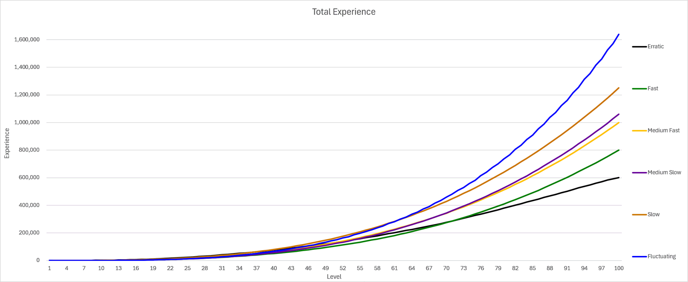

The datasets I am using for my final project are Pokemon datasets. In the game Pokemon, each Pokemon gains levels at a different rate, and these rates can be classified into 6 different experience groups as follows. These groups are: Erratic, Fast, Medium Fast, Medium Slow, Slow, and Fluctuating. Pokemon in the Erratic group need less exp than Pokemon Fast group to reach level 100, Pokemon in the Fast group need less exp than Pokemon in the Medium Fast group to reach level 100, and so on. There are differences in these groups, such as Pokemon in the Erratic group actually require more exp to get to level 50 than Pokemon in the Fast groups. Below is the graph of the experience distributions for reference. The reason I chose this dataset is simple - I like Pokemon and wanted to learn a little bit more about it from a data perspective.

My goal for this project will be to, based on the other attributes of Pokemon, such as their base stat total, their home generation (essentially meaning the game that the Pokemon first debuted in), their capture rate, and other factors, can we predict which of the 6 experience groups they are in? 

The Datasets I used are from the following sources.
https://www.kaggle.com/datasets/rounakbanik/Pokemon
https://www.kaggle.com/datasets/kylekohnen/complete-Pokemon-data-set

I will start by going over the first dataset. The first dataset goes through a list of the first 7 generations of Pokemon, and has most of the useful attributes that I would want such as their typing, stats, their experience group, and their abilities. However there were noticable problems I found in the dataset. First of all, for Pokemon that have a mega-evolution (I won't go into details of this mechanic, but know that it allows certain Pokemon to grow stronger for the duration of 1 battle.), their stats in their mega-evolution form were listed, instead of their non-mega form. This unintentionally changes their base stat total to be much higher than intended which could cause problems. Also, this dataset was lacking some information that I knew I wanted. Fields such as "base_experience" (the amount of experience a Pokemon gives upon fainting to the opposing Pokemon) I thought may especially be useful, along with a few other fields like their egg group, color, etc. I also was able to use this second dataset to fix the previous base stat total problem I mentioned, and by joining the two, I was able to accomplish a much more complete, more correct dataset. From these datasets I was able to construct a few more things, such as the Pokemon's evolution tree, and how far that Pokemon is in the Pokedex, relative to that generation. There was a few Pokemon that in joining the dataset as well that needed to be fixed as well, due to small differences in name. (Eg. Mr. Mime versus Mr Mime)

***Experience Group Analysis***

The below graphic represents, per of the 7 generations in my dataset, the distribution of the experience groups in each generation. 

This graphic alone gives an incredible amount of information. The most important thing to note is that the distribution is nowhere near close to being equal. Most Pokemon are within the groups Slow, Medium Slow, or Medium Fast, with the Fast group being much less common, but still consistently appearing throughout each generation. Notably however, there are two experience groups only appearing in Generation 4 and Generation 3: Those being the groups Erratic and Fluctuating. Additionally, they are both really small in number even within those generations. 

**Fluctuating**

Looking at the Fluctuating group, which has only 14 Pokemon (there are 801 in the set), I could not find any discernable pattern among them relating to their attributes. The only thing I could find, was that on average, Pokemon in this group had higher base HP than any other group.  Due to the sample size being so incredibly low this could very well, and probably just is noise. Looking at the Pokemon themselves, there are no notable features that they share; some are bipedal, some are fish, some are land creatures, some fly. For my classifier I am very much considering simply not ever classifying into this group, and it's simply too specific and unpredictable. It also being tied down to 2 specific generations would also require insider knowledge that a prediction model simply should not have access to, and I fear that including it would do more harm to other experience types than good. Trying to include this group seems like it would pretty much just be memorization, which obviously a classifier prediction model should not do.

**Erratic**

The Erratic group is not much better in all honesty. With a total of 22 Pokemon the sample size as well is quite pitiful. Unlike the Fluctuating group, there is somewhat of a pattern between these Pokemon however. The group is consisted of mostly non-early game bug type Pokemon, Pokemon that are classified as "fossil Pokemon", and water-type Pokemon with non-traditional evolution methods. Even within this however there are outliers, such as Finneon/Lumineon, which is a pretty basic fish Pokemon with a normal evolution method, and Swablu/Altaria, which are bird-like Pokemon. Still, the issue mainly lies in the small sample size and the fact that this group is only present in two of seven generations. As such it is unlikely that my classifier model will output this Erratic group as well due to similar reasons to the above fluctuating group. 

**Fast**

The Fast group is another group, but this time it seems to be much more predicatable than the previous two. There are 56 Pokemon in this group, which is relatively small, but still very workable. The main differences between Fast and the previous two groups is that 1. There exists Pokemon from this group in every generation and 2. There seems to be a pretty clear pattern on which Pokemon are likely to be in this group. Just by looking at the list of Pokemon, it seems to be mostly Ghost-type Pokemon, as well as Pokemon that are generally "cute". That latter part is a bit harder to categorize from the data given, however I did find a solid signal from the following:

Looking at the Fast group on this, it can be seen that the color "Pink" is the predominant color in the fast experience group. In the other experience groups the color pink is a fairly low percentage, but it seems to be much, much higher for the fast group. This comes back to the part of the previous conclusion - that this group is partially associated with cute Pokemon, and pink is a cutesy color.

**Slow**

Moving on to the next experience group, the Slow group, with 172 total Pokemon, there is already much more Pokemon, and thus data to work with. Funnily enough, this experience group is probably the easiest one to classify, as the slow experience group is tied to having very strong Pokemon. Logically, this makes sense - the Pokemon that are the strongest should be the slowest to train and grow (Excluding the Fluctuating group, as that group is just weird). These Pokemon have pretty clear signals; They by far have the highest average weight, the lowest catch rates, give the most experience points when defeated, contain almost all of the "legendary Pokemon", and have by incredibly far have the most amount of egg steps. (Egg steps is the amount of steps needed to take to hatch a Pokemon egg, per Pokemon species.)

Below this egg steps comparison can be seen. Most other groups on average take about 6,000 steps, while this group on average takes 15,000 steps. The signals for this group are pretty clear, and I wouldn't doubt getting about 80-90% accuracy on the predictions on this group specifically.

**Medium Slow**

The Medium Slow grouping is the second to last experience group that needs to be discussed, with 202 Pokemon total. The signals for this group were significantly harder to exactly pinpoint, but I do have a fairly good idea of what type of Pokemon are within this group. First thing to note, is that the first 9 Pokemon of every generation will ALWAYS be in this medium-slow grouping. The reason for this being that the first 9 Pokemon are ALWAYS the starter Pokemon. As an example, the first generation has Bulbasaur, Ivysaur, Venusaur, Squirtle, Wartortle, Blastoise, Charmander, Charmeleon, and Charizard as the first 9 Pokemon. These are the starter Pokemon, and every generation has exactly 9 at the very beginning, making them very easy to predict. As well as this, Pokemon in this group are almost all apart of an evolution line - meaning they evolved from a different Pokemon, or can evolve into a new one. Considering there are many Pokemon that don't evolve, this is quite useful information to have. Graphing the evolution data against the experience groups gives a quite clear signal overall.

.png>)

This is by far the strongest signal overall to determine the groupings of Medium Slow, as well as for Medium Fast. The medium slow group consists of almost all Pokemon with a 2 stage evolution, meaning that from their weakest form, they can evolve twice. This in a way, does make good sense. If I were to put the experience groups on a line, Medium Slow is closest to the Slow group, which I have established consists of strong Pokemon, many of which are legendaries, or other Pokemon with very high stats. The Medium Slow grouping thus has powerful Pokemon, but they aren't legendary status (with very few exceptions), but these Pokemon need to grow to get there. It makes sense, then, to get to be powerful, they need to evolve twice. This experience grouping thus are Pokemon that perhaps you can get somewhat early on in the game, but still can grow to be strong into the late-game. Pokemon that need to evolve that are in the Slow group are different as they are obtained in the mid-to-late game, and are incredibly strong in the late-game generally.

**Medium Fast**

The last grouping is the Medium Fast grouping which was previously mentioned, with 335 total Pokemon. Again, there is a good amount of signal visble from the previous graphic, as it can be seen that the vast majority of Pokemon from the Medium Fast group have 1 evolution stage, meaning in their weakest form, they can only evolve once. They can typically get to the peak of their power faster than Pokemon in the Medium Slow group as they have to evolve 1 less time, but to compensate typically don't get as strong as Pokemon that need to evolve twice to get to the peak of their power. This can loosely be seen in the below graphic. The vertical axis represents the base stat total (That is the sum of all of their base stats such as Attack, Defence, etc.). This assumes all Pokemon are in their final evolution stage. You can see a trend in the base stat totals between the Fast, Medium Fast, Medium Slow, and Slow groupings, being that the more experience required to reach level 100, the higher the Pokemon's stats will be.

Overall, from this EDA the most important things I learned is that these experience groupings operate on somewhat of a spectrum, from Fast->Medium Fast->Medium Slow -> Slow. This spectrum can be roughly estimated through the final-stage evolution's base stat total, and how many evolutions it took to get there. The most importnant signals I found were definitely the evolution stage count, the number in generation the Pokemon is relative to the start of the generation, the base stat total, and surprisingly, at least for the Fast group color, as Pink is a surprisingly decent signal for that group. I anticipate facing somes challenges due to data sparcity overall however, as I don't even have 1000 entries. On top of that 2 of the 6 groups (Fluctuating and Erratic) are so small that it's really just not possible to predict them without having them memorized or having their specific rules memorized. But the other 4 groups, which are over 95% of the data do have solid signals to work off of. 