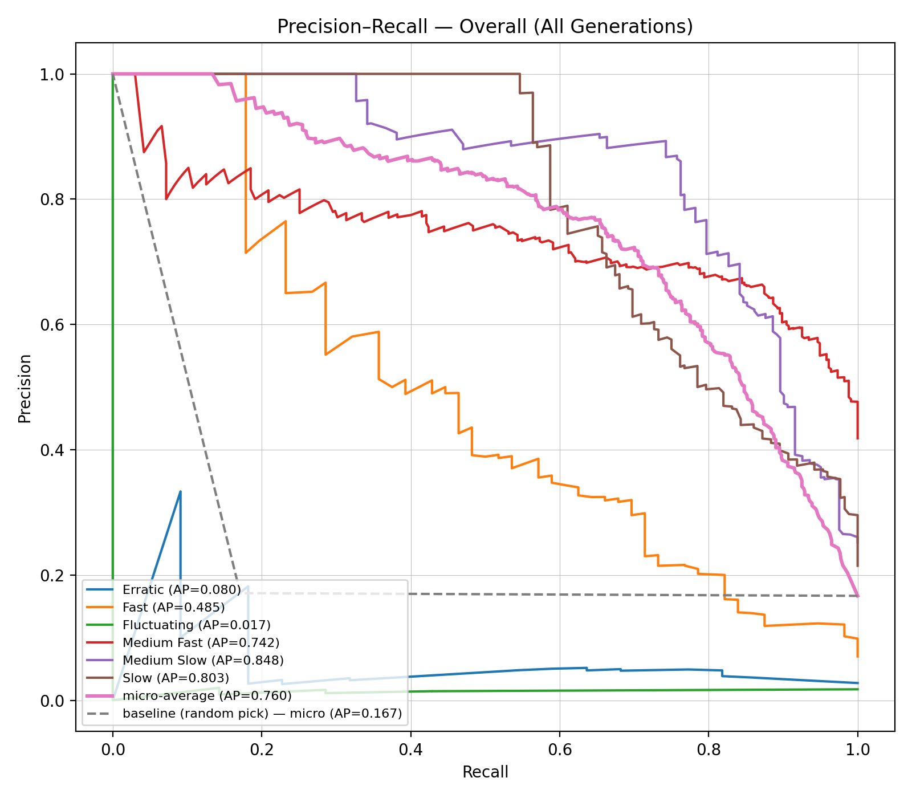

Author - Aiden Rodriguez / GH Aiden-Rodriguez

Pokemon is a game that is ultimately about raising a group of creatures to create a well-rounded team to take on your foes in battle. But have you ever wondered why it feels like some Pokemon grow faster than others? Well, simply put, it's because they do! Each Pokemon is put into one of 6 experience groups that determines how much experience points they need to level up. The experience groups can be shown at a basic level as the following:

| Exp needed to reach level 100 | Experience Group |
|-------------------------------|------------------|
| 600,000                       | Erratic          |
| 800,000                       | Fast             |
| 1,000,000                     | Medium Fast      |
| 1,059,860                     | Medium Slow      |
| 1,250,000                     | Slow             |
| 1,640,000                     | Fluctuating      |

This then begs the question, what determines which experience group a Pokemon is in? Essentially, what determines how fast a Pokemon grows and levels up? The answer is not actually as simple as you might think. Each Pokemon has many attributes that makes them unique. Each Pokemon has a typing, abilities, stats, height, weight, some have evolutions and some don't, color, shape, how hard it is to hatch an egg of that species, the list goes on. Some of these attributes showcase power, rarity, even cuteness to a degree. And each may or may not help to determine which experience group a Pokemon belongs to.

To find out the features that influence which experience grouping a Pokemon belongs to, I first of all needed data of Pokemon to work off of. [text](eda_summary.md) Shows the full scope of how data was obtained, signals for certain experience groupings, and how certain features were discovered to have stronger signals to which experience grouping a Pokemon belonged to. But the long and short of it is that essentially the experience grouping are on a line that vaguely represents a Pokemon's power level overall. The spectrum being Fast->Medium Fast->Medium Slow->Slow, where Fast is the side of the spectrum where generally weaker Pokemon live, and Slow is where genrally stronger Pokemon live. Thinking about this logically, it makes decent sense, a Pokemon who is harder to train and requires more resources should be stronger to compensate for the fact that they need more experience to grow. You may notice however that I left out two groups from the previous spectrum, those being the groups of Erratic and Fluctuating. The issue with these groups is that there are so few Pokemon in them that it's hard to get an understanding of the grouping itself. To put it into perspective, each of these groups contain less than 25 Pokemon, and there is 800 Pokemon in the dataset. Thus, finding patterns among them is pretty much impossible due to the lack of data. Additionally, they in no way follow the previous "Strength" based spectrum. 

*Figure 1. Shows how a Pokemon's BST compares to their experience grouping.*

It can be seen from this graphic that the BST (Base stat total, which is the sum of a Pokemon's base stats) follows the previous spectrum, that being Fast->Medium Fast->Medium Slow->Slow correlates to a Pokemon's strength, in this case their BST. However Fluctuating and Erratic groups here are different, with their average BST being around the middle of the pack, even though their experience requirements to reach level 100 are on the polar ends of the spectrum. Because of these group's inherent lack of data and weirdness, they are essentially impossible to predict both manually, but also algorithmically.

From [text](eda_summary.md) I was able to determine a few more correlations about the data. The amount of evolutions that a Pokemon has from its weakest form gives a very strong idea of which experience group it belongs to, and additional fields such as a Pokemon's color, and their male to female ratio were important to discovering which group they were in.

.png>)
*Figure 2. Shows how a Pokemon's total number of evolution stages compares to their experience grouping.*

With the right features in place, it was now possible to build a classifier for to determine what a Pokemon's experience grouping could be based upon these parameters. We can now predict essentially how fast a Pokemon will grow based on their other attributes! The data in total has 7 generations of Pokemon, split by which game they were introduced in. (Eg Pokemon Red and Blue form a generation, Pokemon Gold and Silver form another generation, and so on). This is relavant as it actually gives us an in-built test-train split that we can use to analyze how good the classifier is! By testing on 1 generation, and trainining the classifier on the other 6, we can evaluate the accuracy of the classifier based on how many predicted experience groups it actually got correctly. Since the dataset of Pokemon is small (801 Pokemon to be precise), we can test on every single generation of Pokemon individually, with each test having a training set of the other 6 generations. This allows for the evaluation of the accuracy of the classifier overall of every single Pokemon. That is, given data of Pokemon from an unrelated generation with their experience groupings, it should be able to predict which experience grouping a Pokemon falls into, knowing the Pokemon's other attributes.

The classifier algorithm used was Random Foresting. From testing, I found that this was the most effective at dealing with the small dataset (Again, 801 Pokemon total). Other algorithms would likely be better if I was able to have more data, however because the nature of the data of Pokemon is man-made, more data is not something that I can simply obtain in large quantities.

The results of the classifier are the following:

## Overall (All Generations)

| Experience Group | Support | Correct | Incorrect | Accuracy | Predicted Count |
|------------------|---------|---------|-----------|----------|-----------------|
| Erratic          | 22      | 0       | 22        | 0.000    | 0               |
| Fast             | 56      | 9       | 47        | 0.161    | 10              |
| Fluctuating      | 14      | 0       | 14        | 0.000    | 0               |
| Medium Fast      | 335     | 297     | 38        | 0.887    | 456             |
| Medium Slow      | 202     | 160     | 42        | 0.792    | 198             |
| Slow             | 172     | 113     | 59        | 0.657    | 137             |

**Totals**
- **Total Pokémon:** 801  
- **Overall Correct:** 579  
- **Overall Incorrect:** 222  
- **Overall Accuracy:** 0.723

Essentially this means that 72.3% of predictions made by the classifier were correct predictions. Thus, given a new generation of Pokemon that hasn't been released yet, I would expect this classifier to achieve around 72% accuracy in predicting a Pokemon's experience grouping. 

Looking at the accuracy of the groups you may notice that the Erratic and Fluctuating groups all have 0%. And I would argue that this makes complete logical sense actually! The amount of data for these groups is so small that accurately predicting them is near impossible. Even as a person who knows the ins and outs of Pokemon, I would not be able to list these groups and the Pokemon within them. It simply is a problem that is impossible to predict without memorizing what Pokemon are in those groups.

The Fast group is also an interesting case. Of the 10 predictions of the Fast group, 9 were correct. Even though there were 50 total Pokemon, it can be said that when this group was predicted, it was predicted with high precision. This shows that this group actually had quite solid signals, however it wasn't guessed too commonly. This can likely be attributed to once again, having a small amount of data. With 56 Pokemon total, just based upon the odds alone, it's unlikely for a Pokemon to be in this group, and as such, in training the random forest, it's likely there simply wasn't enough data about this group to produce results for it. 

The final three groups all had a good amount of data, and as such they all had accuracies of above 65%. It goes to show that having more data is really neccisary for coming up with a good classifier. Even as a human, it's gonna be hard to predict the experience groups as such with such limited data, and much easier as more Pokemon are in the experience group. 

*Figure 3. Shows the precision and recall of each group. The micro-average group represents the overall performance.*

With all being said, I would say that this classifier was a huge success. Achieving 72.3% accuracy overall was not what I expected at all coming into this. Initially, I thought I would struggle to reach even 60% accuracy due to the nature of the small dataset. There was not even 1,000 datapoints to work off of, and due to the nature of the data being made by a bunch of Japanese people coding things together in an office building, I thought signals would be rare to come across. However, solid signals were there to work off of, and even if logic for finding what determines a Pokemon's experience group was not consistent, and many outliers existed, I was able to achieve an accuracy to be proud of.  